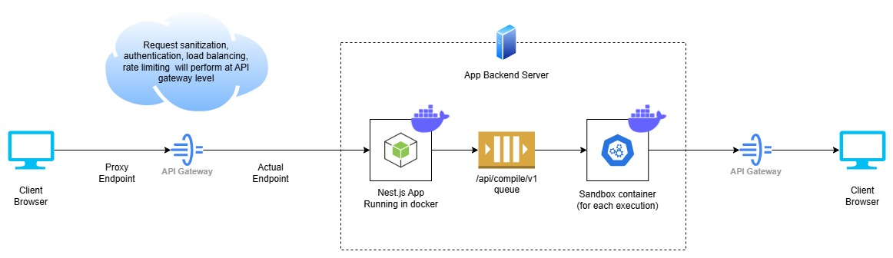

# 🚀 Online Multi-Language Code Execution Platform

**An open-source solution to power your next big online programming platform!**

Looking to build the next [**NeetCode**](https://neetcode.io/),
[**LeetCode**](https://leetcode.com/), [**HackerRank**](https://www.hackerrank.com/)?
**simple-online-programming** is the ultimate **open-source substitute to
[Judge0](https://github.com/judge0/judge0)**, designed to give you the flexibility, performance, and
features needed to create a high-performing, customizable online coding platform.

With **simple-online-programming**, you can rapidly implement a powerful, scalable solution to
compile and execute code in multiple programming languages perfect for **students**, **startups**,
and **businesses**. Whether you're creating a competitive coding platform, a coding tutorial app, or
an educational tool, we've got you covered. And it's all backed by **clean documentation**,
**well-structured CI/CD pipelines**, and a sleek, responsive UI built in **Angular**.

Why limit yourself to rigid, hard-to-extend platforms? With **simple-online-programming**, you get
**control, flexibility**, and **freedom** to expand with **new languages**, tailor execution
environments, and deploy at scale.

## ✨ Why Choose simple-online-programming?

1. **Comprehensive Language Support:**

    - Out-of-the-box support for 15+ programming languages, including `C`, `C++`, `Java`, `Python`,
      `TypeScript`, `Go`, `Kotlin` and more.
    - Need more languages? No problem! Add any language you want, with easy extensibility to match
      your platform's needs.

2. **CI/CD Ready for Lightning-Fast Deployment:**

    - Streamlined, pre-configured CI/CD pipelines ensure your platform is continuously integrated,
      tested, and deployed.
    - Fully Dockerized for consistent, secure, and scalable environments.

3. **Responsive, Modern UI/UX:**

    - Built with **Angular**, the front-end experience is clean, modern, and responsive, providing
      users with a smooth, intuitive interaction whether they’re on desktop or mobile.
    - Customize the frontend to fit your brand’s style and user experience.

4. **Seamless Queue & Execution Management with Redis + Bull:**

    - Ensure smooth, efficient execution even under heavy load using Redis and Bull queues.
    - Whether handling a single user’s code submission or millions, the system scales without
      breaking a sweat.

5. **Docker-Powered Isolation:**

    - Code execution is sandboxed within isolated Docker containers, giving you secure, scalable,
      and independent environments for every request.

6. **Perfect for All:**
    - Whether you're a **startup** building the next big thing, an **educator** delivering engaging
      lessons, or a **business** building custom tooling, **simple-online-programming** offers a
      highly flexible and extensible foundation.

## 🏛️ Architecture



## 🏗️ Project Structure

```
└── simple-online-programming/
    ├── .github
    │   └── workflows
    ├── LICENSE
    ├── README.md
    ├── apps
    │   ├── backend
    │   ├── backend-e2e
    │   ├── frontend
    │   └── frontend-e2e
    ├── devops
    │   ├── backend
    │   └── frontend
    ├── docker-compose.yml
    ├── jest.config.ts
    ├── jest.preset.js
    ├── libs
    │   └── shared
    ├── nx.json
    ├── package-lock.json
    ├── package.json
    ├── scripts
    │   ├── dependency.verifier.js
    │   ├── env.builder.js
    │   ├── frontend.ignite.js
    │   ├── generate.module.js
    │   ├── upgrade.js
    │   └── vs.extensions.setup.js
    └── tsconfig.base.json
```

## ⚡ Quick Start Guide

### Prerequisites:

Ensure that you have the following installed:

-   [Node.js (>= 20.17.0)](https://nodejs.org/en/download/package-manager)
-   [Docker Desktop](https://www.docker.com/products/docker-desktop)
-   [Redis](https://redis.io/)
-   [Visual Studio Code (Recommended)](https://code.visualstudio.com/Download)

### Setup Instructions

1. Clone the repository.
2. Install the project dependencies using the following command:

    ```bash
    npm install
    ```

    This will:

    - Validate your Node.js and npm versions.
    - Install recommended VS Code extensions.
    - Create an environment file from the sample if one does not exist.

3. Run the project using Docker (optional):

    ```bash
    npm run docker:up
    ```

    This is optional, you can run the project even without Docker:

    - Use `npm run frontend:serve` command to run **frontend**.
    - Use `npm run backend:serve` command to run **backend**.

### Frontend Commands

-   **Build**: Builds the frontend project after prompting for the environment.

    ```bash
    npm run frontend:build
    ```

-   **Unit Tests**: Runs unit tests for the frontend.

    ```bash
    npm run frontend:test
    ```

-   **E2E Tests**: Runs E2E tests for the frontend.

    ```bash
    npm run frontend:e2e
    ```

-   **Serve**: Serves the frontend project after prompting for the environment.

    ```bash
    npm run frontend:serve
    ```

### Backend Commands

-   **Build**: Builds the backend project.

    ```bash
    npm run backend:build
    ```

-   **Unit Tests**: Runs unit tests for the backend.

    ```bash
    npm run backend:test
    ```

-   **E2E Tests**: Runs E2E tests for the backend.

    ```bash
    npm run backend:e2e
    ```

-   **Serve**: Serves the backend project.

    ```bash
    npm run backend:serve
    ```

### Upgrade Project Dependencies

There is a custom script to upgrade all project dependencies. If an error occurs during the upgrade,
the script will automatically rollback the changes.

```bash
npm run upgrade
```

### Generate module for frontend or backend

This custom script streamlines the creation of new modules for either frontend or backend projects.
It prompts the user for input on module and component/controller names, generates the necessary
files and directories.

```bash
npm run generate:module
```

## 🔧 Environment Variable Guide for New Variable

1. **Local Development**

    Set up environment variable in a `.env` file.

2. **Local Development with Docker**

    Set up environment variable in both the `.env` file and `docker-compose.yml`.

3. **Dev, UAT, Prod Environments**

    Configure environment variable within CI/CD pipeline files.

**Note**: Depending on the project requirements, you may also need to configure environment variable
in the backend or frontend configuration files.

## 📋 Sample Environment Variables

Below is a sample `.env` file. This file should not contain sensitive or production-specific values.
For real environment variables, ensure they are managed securely.

```env
# ====================== DISCLAIMER =======================
# This file is a sample configuration for environment variables.
# It should be committed to version control to provide a reference
# for required variables and their names. However, it should not
# contain sensitive or production-specific values.
#
# The actual `.env` file should contain real values and must be
# added to .gitignore to prevent it from being tracked in the
# repository. Ensure that sensitive information is securely managed
# and kept private.
# =========================================================

######################################
#### Common Environment Variables ####
######################################
PORT_FRONTEND=4000

# Note: PORT_BACKEND change required inside apps/frontend/src/config/config.ts too
PORT_BACKEND=8000

# Note: APP_ENV can be only LOCAL, DEV, UAT, or PROD
APP_ENV=LOCAL

MIN_NODE_VERSION='20.17.0'
MIN_NPM_VERSION='10.8.2'

#######################################
#### Backend Environment Variables ####
#######################################

# Note: ROUTE_PREFIX change required inside apps/frontend/src/config files and spec file too
ROUTE_PREFIX=api

KEY_VAULT_URI=
TENANT_ID=
CLIENT_ID=
CLIENT_SECRET=

########################################
#### Frontend Environment Variables ####
########################################
```

## 🔌 Default Ports

-   Frontend: http://localhost:4000
-   Backend: http://localhost:8000

## 💻 API: Flexible and Developer-Friendly

The backend API lets you compile and execute code from any client interface. Here’s an example:

#### Request Model:

```json
{
    "SourceCode": "console.log(1+1)",
    "ProgrammingLanguage": "TypeScript",
    "ExecutionPower": "low",
    "TimeOut": 30,
    "RunTimeInput": ""
}
```

#### Example API Request (cURL):

```bash
curl --location 'http://localhost:8000/api/compile/v1' \
--header 'Content-Type: application/json' \
--data '{
    "SourceCode": "console.log(1+1)",
    "ProgrammingLanguage": "TypeScript",
    "ExecutionPower": "low",
    "TimeOut": 30,
    "RunTimeInput": ""
}'
```

### Example Responses:

#### **Success Response:**

```json
{
    "IsSuccess": true,
    "Message": "Success",
    "Data": {
        "CompilerVersion": "nodejs:typescript",
        "CompilationStatus": "Success",
        "ExecutionDetails": {
            "Output": "2\n",
            "Errors": null,
            "ExecutionTime": "2.163s"
        }
    },
    "Errors": []
}
```

#### **Error Response:**

```json
{
    "IsSuccess": true,
    "Message": "Success",
    "Data": {
        "CompilerVersion": "nodejs:typescript",
        "CompilationStatus": "Execution failed",
        "ExecutionDetails": {
            "Output": null,
            "Errors": "../source-code/4b26d9dc-d2cb-4a6f-b325-e39024065706/Main.ts(1,17): error TS1005: ';' expected.\n",
            "ExecutionTime": "1.608s"
        }
    },
    "Errors": []
}
```

## 🌍 Who Can Benefit?

1. **EdTech Startups**: Launch your interactive coding platform faster, with built-in support for
   real-time code execution across multiple languages.
2. **Enterprises**: Provide secure, isolated, and powerful programming environments for internal
   development or external customer solutions.
3. **Educators**: Build your own online coding labs where students can learn, practice, and compete.
4. **Hackathons & Competitions**: Host coding competitions with ease, handling large numbers of
   submissions securely and reliably.

## 👨‍💻 Author Information

-   **Author**: Karan Gupta
-   **LinkedIn**: [Karan Gupta](https://www.linkedin.com/in/karangupta0005)
-   **GitHub**: [Karan Gupta](https://github.com/Karan0005)
-   **Contact**: +91-8396919047
-   **Email**: [karangupta0005@gmail.com](mailto:karangupta0005@gmail.com)

## 🌱 **Powered by Simple Web App Boilerplate**

We built **simple-online-programming** using the amazing
**[Simple Web App Boilerplate](https://github.com/Karan0005/simple-web-app-boilerplate)**. This
open-source boilerplate made the development process fast and efficient, It’s the perfect starting
point for any project, saving time and effort. Check it out and speed up your development just like
we did!

## 🤝 Contributions

Contributions are welcome! Here are several ways you can contribute:

1. **Fork the Repository**: Start by forking the project repository to your github account.

2. **Clone Locally**: Clone the forked repository to your local machine using a git client.

    ```sh
    git clone https://github.com/Karan0005/simple-online-programming
    ```

3. **Create a New Branch**: Always work on a new branch, giving it a descriptive name.

    ```sh
    git checkout -b new-feature-x
    ```

4. **Make Your Changes**: Develop and test your changes locally.

5. **Commit Your Changes**: Commit with a clear message describing your updates.

    ```sh
    git commit -m 'Implemented new feature x.'
    ```

6. **Push to github**: Push the changes to your forked repository.

    ```sh
    git push origin new-feature-x
    ```

7. **Submit a Pull Request**: Create a PR against the original project repository. Clearly describe
   the changes and their motivations.

8. **Review**: Once your PR is reviewed and approved, it will be merged into the main branch.
   Congratulations on your contribution!

-   **[Report Issues](https://github.com/Karan0005/simple-online-programming/issues)**: Submit bugs
    found or log feature requests for the `simple-online-programming` project.

## 📝 License

This project is licensed under the MIT License.
